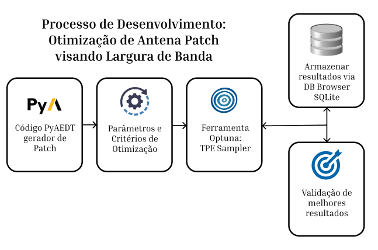

# 🔬 Atividades Optuna – Otimização de Antenas

Repositório desenvolvido no contexto de Iniciação Científica no **WAI Lab** e **RadioCom Lab**, com foco na aplicação do framework **Optuna** para otimização de antenas.

📍 Curso: Engenharia de Computação  
📍 Ano: 2026  
📍 Laboratórios: Wireless and Artificial Intelligence Lab (WAI Lab)  

---

# 📘 Caderno de Experimentos  
## Otimização de Antenas

Este repositório documenta a evolução do uso do Optuna desde problemas matemáticos simples até a integração com o **PyAEDT** para otimização de antenas patch impressas no HFSS.

---

# 🧠 Estrutura das Atividades

## ✅ Atividade 01 – Minimização de Funções

Objetivo:  
Encontrar as raízes da equação:

\[
x^2 + 6x + 5 = 0
\]

Como o Optuna é um **minimizador**, a função objetivo foi estruturada para minimizar:
\[
abs(f(x))
\]

Buscando o valor de `x` que aproxima o resultado de zero.

---

## ✅ Atividade 02 – Comparação de Samplers

Comparação entre:

- `TPESampler` (modelo probabilístico, aprende com trials anteriores)
- `RandomSampler` (busca totalmente aleatória)

Critérios analisados:

- Velocidade de convergência
- Número de tentativas necessárias
- Eficiência de busca

Foi implementado critério de parada para comparar desempenho entre os samplers.

---

## ✅ Atividade 03 – Persistência e Banco de Dados

Implementação de armazenamento dos experimentos utilizando:

# SQLite

Funcionalidades:

- Criação de arquivo `experimento.db`
- Inspeção via DB Browser for SQLite
- Reinício do estudo carregando dados anteriores
- Continuidade do histórico de trials

---

## ✅ Atividade 04 – Visualização Avançada

Uso do módulo:
optuna.visualization

Gráficos gerados:

- Histórico de otimização
- Slice Plot
- Análise de convergência

Objetivo: compreender comportamento do algoritmo e influência dos parâmetros.

---

# 🚀 Atividade 05 – Otimização de Antena Patch com PyAEDT

## 🎯 Objetivo

Integrar o **PyAEDT** ao **Optuna** para maximizar a largura de banda de uma antena patch impressa com frequência central em:

f₀ = 3.5 GHz

---

## 📡 Critérios de Projeto

- Banda de operação: 2 GHz – 4 GHz
- Critério de casamento: S11 ≤ -10 dB
- Meta principal:  
**Maximizar a largura de banda mantendo casamento próximo a 3.5 GHz**

---

## 🧩 Variáveis Utilizadas na Otimização

A busca inclui obrigatoriamente:

- 🔹 Variáveis Contínuas  
- 🔹 Variáveis Discretas  
- 🔹 Variáveis Categóricas  

---

## ⚠️ Estrutura da Função Objetivo

Como o Optuna minimiza por padrão, foi estruturado um **score** para representar:

- Maior largura de banda
- Frequência central próxima de 3.5 GHz

O estudo foi configurado para:
direction="maximize"

---

## 🛠 Ajustes Técnicos Implementados

Durante o desenvolvimento foram corrigidos pontos importantes:

- Criação de variáveis diretamente dentro do HFSS
- Correção da Lumped Port (integration_line)
- Evitar abertura/fechamento repetitivo do software
- Integração completa entre:
  - PyAEDT
  - HFSS
  - Optuna
  - SQLite

---

## 📊 Persistência dos Experimentos

- Banco atualmente contém múltiplas geometrias testadas
- Histórico completo salvo via SQLite
- Validação final dos melhores resultados

---

## 🔄 Processo de Desenvolvimento

Abaixo está o fluxo geral da otimização implementada:

  

# 📈 Resultados

✔️ Integração bem-sucedida entre modelagem eletromagnética e otimização  
✔️ Maximização da largura de banda  
✔️ Resultado validado em simulação  

---

# 👩‍🔬 Autoria

Laura F. C. Ferreira  
Graduanda em Engenharia de Computação – 5º período  
WAI Lab & RadioCom Lab  

---

# 📌 Observação

Este repositório documenta a evolução técnica da aplicação de algoritmos de otimização em problemas reais de engenharia de RF, integrando inteligência artificial e modelagem eletromagnética.

